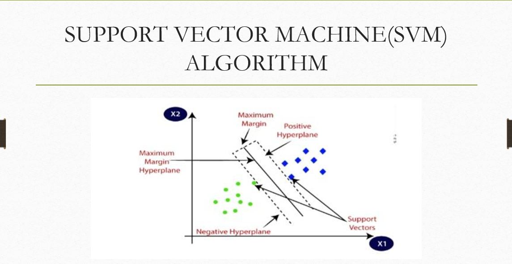
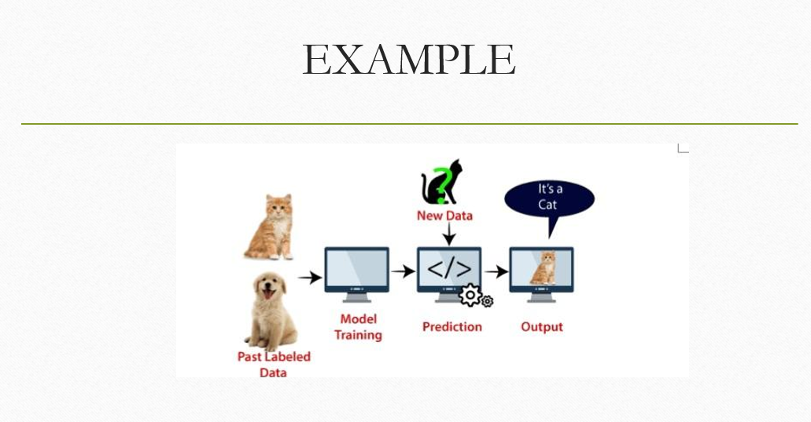
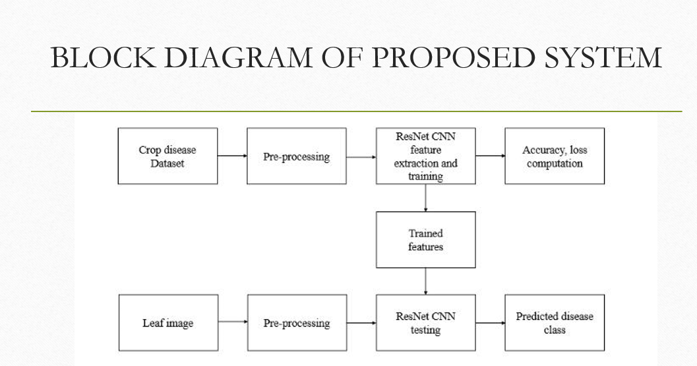
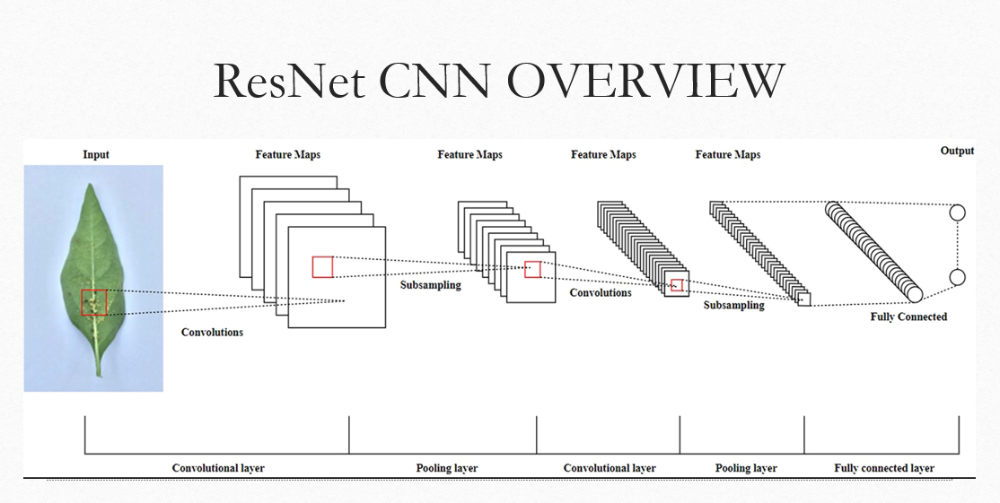
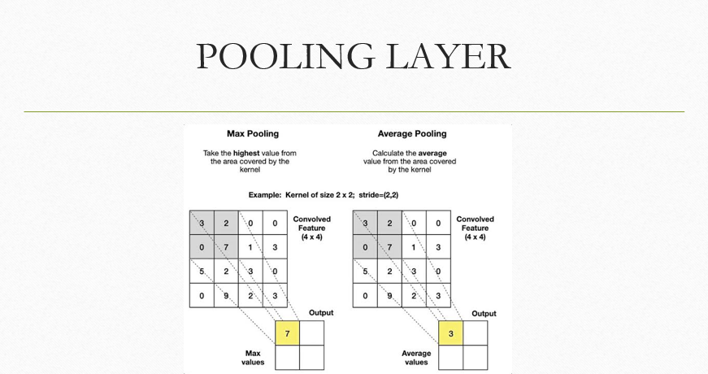
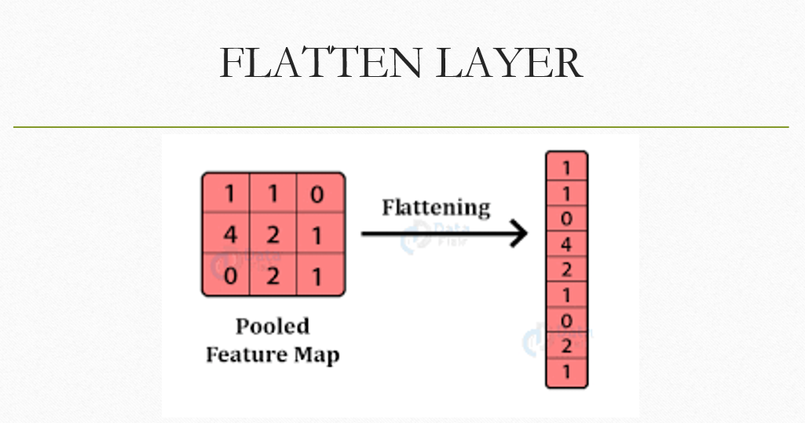
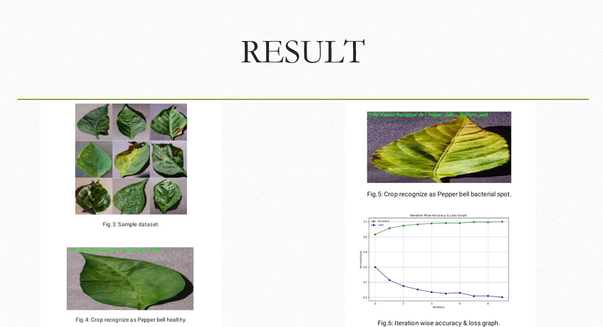

# DISEASE DETECTION IN CHILLI PLANTS AND REMOTE MONITORING OF AGRICULTURAL PARAMETERS


### Table of Contents

- [ABSTRACT](#abstract)
- [INTRODUCTION](#introduction)
- [EXISTING SYSTEM](#existing-system)
- [PROPOSED SYSTEM](#proposed-system)


### ABSTRACT
Agriculture, the backbone of nations, provides essential food and raw materials. Detecting chilli plant diseases is crucial due to their impact on food security. Traditional methods, often relying on visual inspection by experts, are commonly used for identifying these diseases. This work focuses on implementing Chilli plant disease detection and classification (PDDC-Net) using deep learning. It includes preprocessing to remove noise and normalize images. The PDDC-Net uses a ResNet-CNN for feature extraction and classification.

### INTRODUCTION
 * China, with over 20% of the world’s population, faces a significant challenge due to limited arable land, which is less than 10% of its total area. Natural disasters can severely impact agricultural output, making stable agricultural development crucial for the country
 * Despite advancements in science and technology, crop yields have not significantly improved due to various natural and non-natural factors. Current research on crop diseases focuses on two main methods: traditional physical methods using spectral detection and intelligent recognition, which is challenging in mountainous areas
 *  This paper proposes developing an Internet of Things (IoT) platform for complex mountainous environments to create a model for identifying crop diseases and pests. The goal is to enhance agricultural informatization, mitigate pest and disease damage, and improve crop yields


### EXISTING SYSTEM
1. There is a system which is existing using Machine Learning(SVM).
2. It is a system which cannot work on image processing directly
3. The third party technique is used to convert image to numerical data
4. Then the Machine Learning algorithm is applied for the image processing




  
 
### DISADVANTAGES

- Performance of these existing machine learning system is less
- No image factors extraction has done in here
- These system takes the more computational time
- And also the no Guarantee of generating output that image classification can work better
- Cannot work on image processing directly


### PROPOSED SYSTEM
1. Here we proposed a plant disease detection system by using RestNet CNN
2. In this RestNet CNN we are again using three layers for image processing. They are:
    * Convolution layer
    * Pooling layer
    * Flatten layer
3. Here the image processing directly takes place no need of third party technology to convert image to numerical data
4. High chances to predicate normal plant and disease plant


  

 

## Convolution Layer
 

## Pooling Layer
 

## Flatten Layer
 

## Result
 

---


### ADVANTAGES

- Performance is very high in Image Classification
- We can easily distinguish the disease and no disease plants
- Computation time is very less in the classifaction of the image
- Works as fast as the image uploaded for testing disease or no disease
- Better image processing where it can extract image features


### How to run it on your local machine
---

1. **Download or clone the repository**
   ```shell
   git clone https://github.com/Thadkapally-Saikiran/Chili-Plant-Disease-Diagnosis.git
   
  - Extract and Go to the directory
  - Keep a separate directory for Directories(Model,ChilliDataset,testImages) and Files(ChilliDiseaseDetection.py,README.txt,requirements.txt,svm.png). Delete remaining files of images
  - project execution process 👉[click here!]([https://github.com/Thadkapally-Saikiran/Automobile-Prediction/blob/main/Automobile_data.csv](https://docs.google.com/document/d/19k9zjTGpG9Q9nXqRgLDyF-7B_tvkpsoa/edit?usp=sharing&ouid=106909648736442819650&rtpof=true&sd=true))
  - Start Exploring!!!


😄

💻
